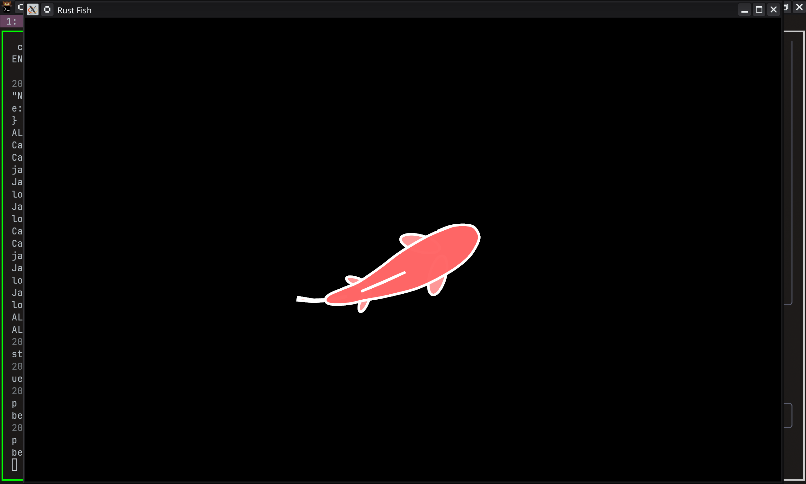

# Procedural Fish Animation

Harro! I recreated this procedural fish animation in Rust using Bevy.



Original project by [argonautcode](https://github.com/argonautcode/animal-proc-anim)


## Running
```bash
cargo run
```

Move your cursor around and watch the fish follow!

## Note
This was an old abandoned project using Bevy 0.14 that I decided to finish. I'll probably add more procedural animations later

